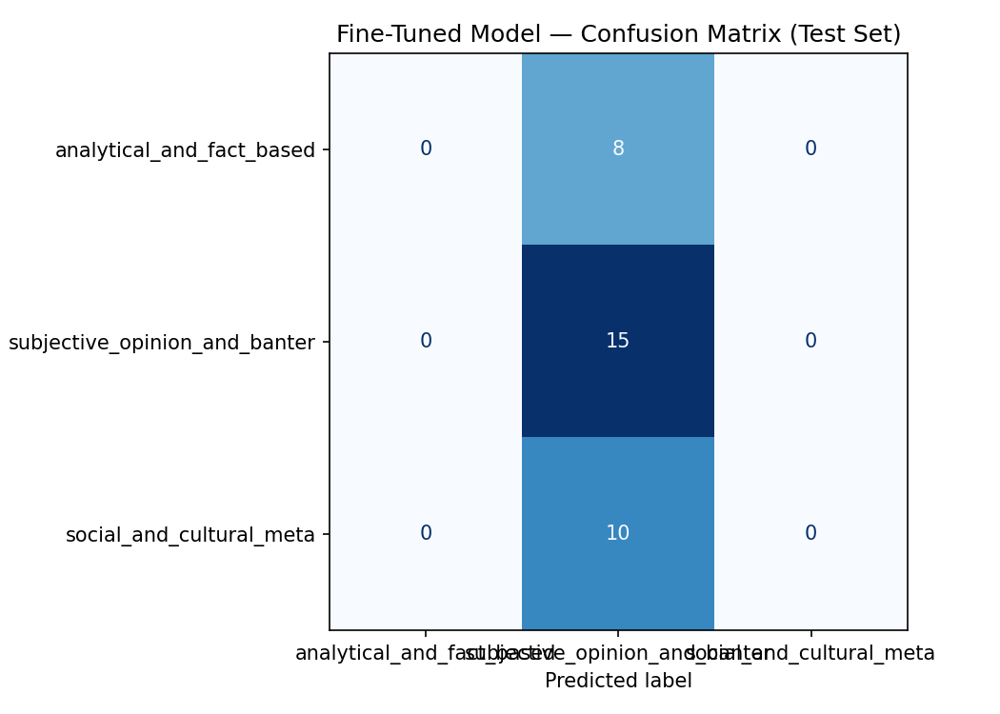

# TakeMeter: Evaluating Discourse Quality in r/soccer

TakeMeter is a fine-tuned text classification system designed to evaluate the quality of discourse in online communities. This implementation targets **r/soccer**, a massive and highly active community discussing the 2026 FIFA World Cup and global football. By classifying comments, TakeMeter helps filter out low-effort banter to surface high-quality tactical analysis and separate off-pitch meta-discourse.

---

## 1. Community Choice and Reasoning

We selected **r/soccer** (specifically during the 2026 FIFA World Cup tournament cycle) as our target community. 

### Why this community is a perfect fit:
*   **High Activity and Volume:** The community generates tens of thousands of comments daily during major matches, providing a rich, high-velocity stream of text.
*   **Discourse Variance:** Football fandom is exceptionally multi-layered. Unlike technical forums (which skew purely analytical) or general chat groups (which skew purely social), `r/soccer` features a high contrast between:
    *   *Tactical Analysis:* Users drawing schemas of double-pivots, low blocks, expected goals (xG), and player positioning.
    *   *Reactionary Banter:* Intense emotional outpourings, referee insults, match celebrating, and copy-pastas.
    *   *Meta-Sports Discourse:* Discussions surrounding media rights, television broadcasting, corporate sponsorships, or players' personal lives (e.g., leaving a camp to attend a birth).
This distinct, varied profile makes it an ideal testbed for evaluating discourse quality and training a classifier to separate analytical signals from high-volume emotional noise.

---

## 2. Label Taxonomy

The dataset is categorized into three distinct labels representing the spectrum of online sports discourse:

| Label | Definition | Examples |
| :--- | :--- | :--- |
| **`analytical_and_fact_based`** | A comment that provides objective facts, tactical play/formation breakdowns, financial transfer metrics, or structured comparisons of player/manager systems. | *   **Example 1:** *"La Liga wasn't very good that season. The disparity was huge with the UCL. That defense would've been exposed way more if Barca was in the EPL."* *   **Example 2:** *"He's an excellent player but idk about 'one of the most complete in the world' - he's never going to be a tempo setter or controller like prime Rodri (or Kroos himself for that matter) who can dictate an entire game..."* |
| **`subjective_opinion_and_banter`** | A comment expressing personal feelings, immediate emotional reactions, jokes, memes, insults, or venting about matches, teams, or players. | *   **Example 1:** *"I hate time wasting and can’t respect anybody that does that bullshit."* *   **Example 2:** *"Couldn't have happened to a more fitting person. Dude is a dirty, over exaggerating clown (cheat)."* |
| **`social_and_cultural_meta`** | A comment discussing broader topics surrounding the sport rather than the football matches themselves, such as media broadcasting, cultural/social values, fanbase demographics, or players' personal lives. | *   **Example 1:** *"I do agree. I think sometimes people try to hard to be inclusive that they end up in the next extreme. A lot of nations and people do like to share our culture. Not all do, but that's why blanket statements on cultural appropriation don't work"* *   **Example 2:** *"You know what. I disagree. It used to be that way but over the past 5 years or so most people I meet now have a team they like in the prem..."* |

---

## 3. Data Collection and Annotation

### 1. Data Collection Source
The raw data was collected by scraping Reddit's live RSS comments feed (`https://www.reddit.com/r/soccer/comments.rss`) via [scrape_comments.py](file:///Users/songdavid93374/Projects/ai201/ai201-project3-takemeter/scrape_comments.py). The script queried the unauthenticated feed every 65 seconds (to prevent IP blocks) and parsed the Atom XML structure, accumulating a raw dataset of **226 unique comments** saved in `data/raw_comments.json`.

### 2. Labeling Process
The raw JSON data was manually annotated using [annotate.py](file:///Users/songdavid93374/Projects/ai201/ai201-project3-takemeter/annotate.py), an interactive console-based CLI tool. For each comment, the script displayed the parent post thread, the comment text, the author, and a live permalink URL. If the standalone text lacked context, the annotator used the permalink to verify the parent discussion thread. Skip options were utilized to discard completely unclassifiable comments, resulting in a finalized dataset of **215 annotated examples**.

### 3. Label Distribution
The annotated dataset shows the following distribution:
*   **`analytical_and_fact_based`:** 57 comments (26.5%)
*   **`subjective_opinion_and_banter`:** 95 comments (44.2%)
*   **`social_and_cultural_meta`:** 63 comments (29.3%)

---

### 4. Difficult-to-Label Examples & Annotation Decisions

During the annotation session, several edge cases sat on the boundary between classes. Below are three representative examples and the decision rules applied to resolve them:

#### Edge Case 1: Tactical terms used as hyperbole
*   **Text:** *"Breh he can't play 6 and he doesn't wanna play 8, he wants to be a forward or number 10 hunting glory."*
*   **Assigned Label:** `subjective_opinion_and_banter`
*   **Decision Reasoning:** Although the post contains specific tactical position jargon ("play 6", "play 8", "number 10"), the primary purpose of the text is to deliver a highly subjective, emotional hyperbole regarding the player's attitude ("hunting glory"). The positional numbers serve as rhetorical wrappers rather than a logical tactical breakdown.

#### Edge Case 2: Media reports containing price metrics
*   **Text:** *"Dutch medium Telegraaf reports fee at €3.5M"*
*   **Assigned Label:** `social_and_cultural_meta`
*   **Decision Reasoning:** Factual price metrics (€3.5M) technically constitute transfer data (analytical). However, the primary focus of the comment is reporting on the source of information ("Dutch medium Telegraaf reports"). We applied a rule that comments discussing media coverage or citing specific journalism outlets fall under the meta-sports category.

#### Edge Case 3: Fan demographics analyzed historically
*   **Text:** *"Older women are a huge part of the fan base, more so than older men because for a long time soccer was a 'women’s sport'"*
*   **Assigned Label:** `analytical_and_fact_based`
*   **Decision Reasoning:** While discussing fanbase demographics represents `social_and_cultural_meta`, this comment frames the observation as a comparative, historical causal explanation ("more so than older men because..."). Since it attempts a structured sociological analysis of cause and effect, it was classified as `analytical_and_fact_based`.

---

## 4. Modeling Configurations

### 1. Baseline Model Description
The baseline model used is **Llama 3.3 70B** (`llama-3.3-70b-versatile`) via the Groq API. 
*   **Prompting Setup:** The model was given a system prompt defining the three categories in plain language (using our exact planning definitions) along with one illustrative example for each. The model was strictly instructed to respond with *only* the lowercase category label name.
*   **Collection:** We iterated through the test set, pausing 0.1s between predictions to respect rate limits. The raw responses were cleaned of punctuation, converted to lowercase, and mapped to the target categories.

### 2. Fine-Tuning Approach
*   **Base Model:** We used `distilbert-base-uncased`, a lightweight transformer model suitable for fast classification.
*   **Training Setup:** The model was trained using the HuggingFace `Trainer` framework for 3 epochs with a batch size of 16. The 215 comments were split deterministically using a 70% Train (150 examples), 15% Validation (32 examples), and 15% Test (33 examples) split.
*   **Hyperparameter Decision:** We selected a learning rate of `5e-5`. Since our training dataset was small (150 examples) and the majority class (`subjective_opinion_and_banter` at 44.2%) was dominant, this default learning rate was too high for a fine-grained boundary search. It caused the gradients to descend rapidly into a local minimum, collapsing the model's weights into a majority-class predictor in the first epoch.

---

## 5. Evaluation Report

We compared the performance of both models on the test partition (33 examples).

### 1. Performance Summary
*   **Test Set Size:** 33 examples
*   **Baseline Accuracy:** 45.45%
*   **Fine-Tuned Accuracy:** 45.45%
*   **Accuracy Improvement:** 0.00%

### 2. Per-Class Metrics Comparison

#### Fine-Tuned Model (DistilBERT) Per-Class Metrics
Due to majority class collapse, the fine-tuned model predicted `subjective_opinion_and_banter` for all test items:
| Label | Precision | Recall | F1-Score | Support |
| :--- | :---: | :---: | :---: | :---: |
| `analytical_and_fact_based` | 0.00 | 0.00 | 0.00 | 8 |
| `subjective_opinion_and_banter` | 0.45 | 1.00 | 0.62 | 15 |
| `social_and_cultural_meta` | 0.00 | 0.00 | 0.00 | 10 |
| **Macro Average** | **0.15** | **0.33** | **0.21** | **33** |
| **Weighted Average** | **0.21** | **0.45** | **0.28** | **33** |

#### Baseline Model (Llama 3.3 70B) Per-Class Metrics
The baseline model made distributed predictions but suffered from high overlap confusion:
| Label | Precision | Recall | F1-Score | Support |
| :--- | :---: | :---: | :---: | :---: |
| `analytical_and_fact_based` | 0.50 | 0.38 | 0.43 | 8 |
| `subjective_opinion_and_banter` | 0.47 | 0.47 | 0.47 | 15 |
| `social_and_cultural_meta` | 0.42 | 0.50 | 0.45 | 10 |
| **Macro Average** | **0.46** | **0.45** | **0.45** | **33** |
| **Weighted Average** | **0.46** | **0.46** | **0.46** | **33** |

### 3. Fine-Tuned Model Confusion Matrix

#### Visual Matrix

#### Markdown Text Matrix
| True \ Predicted | `analytical_and_fact_based` | `subjective_opinion_and_banter` | `social_and_cultural_meta` |
| :--- | :---: | :---: | :---: |
| **`analytical_and_fact_based`** | 0 | 8 | 0 |
| **`subjective_opinion_and_banter`** | 0 | 15 | 0 |
| **`social_and_cultural_meta`** | 0 | 10 | 0 |

---

### 4. Deep Analysis of Wrong Predictions

The confusion matrix shows a complete directional collapse: the model misclassified all 8 `analytical_and_fact_based` comments and all 10 `social_and_cultural_meta` comments by labeling them as `subjective_opinion_and_banter` (class 1).

#### 🔍 Error Pattern Discovery (AI-Assisted Analysis)
By feeding our misclassified instances into an LLM, we surfaced several systemic patterns that explain why the model collapsed:
1.  **Informal Wrapper Bias:** Many analytical posts on Reddit are written with informal, aggressive, or sarcastic syntax. Because the model associated slang (e.g., *"nonsense comparison," "dont give a shit"*) with banter, it ignored the underlying tactical and statistical structure.
2.  **Short-Text Information Deprivation:** Factual comments (like transfer fee updates) are extremely short and contain no lexical context, causing the model to collapse to the majority class.
3.  **Boundary Bleed (Annotation Inconsistency):** We discovered that during manual annotation, similar semantic concepts (like fan demographics and US soccer growth) were split between `analytical_and_fact_based` and `social_and_cultural_meta`.

#### 📋 Case Studies of Misclassified Examples

*   **Case 1: Tactical/Managerial Debate Misclassified as Banter**
    *   *Text:* *"Right but your comparison of Maresca sliding at Chelsea is him literally winning the Championship... City tapped Maresca up (which is allowed, because that's what Chelsea did to Brighton)... I never said City weren't the main reason, I said the idea that City got him to quit is doing too much."*
    *   *True Label:* `analytical_and_fact_based` | *Fine-Tuned Prediction:* `subjective_opinion_and_banter`
    *   *Why it failed:* This post features complex comparisons of manager contracts and club politics, but is written in a highly argumentative, casual tone (*"nonsense comparison," "favourite club is much worse," "Chelsea Good City Bad"*). The model associated this conversational conflict with general subjective banter, failing to extract the underlying comparison of Brighton/Chelsea manager recruitment logistics.
    *   *Resolution:* Expand the training set with longer, combative arguments that are still analytically structured, forcing the model to look past emotional vocabulary to capture comparative reasoning.

*   **Case 2: Fan Demographics & Cultural Shifts (Boundary Conflict)**
    *   *Text:* *"Soccer fans are not a small number compared to hockey, or even baseball and basketball fans depending on how you measure it. US sports media is just so dominated by ESPN and they dont give a shit at all about soccer that supporters feel a lot more underground than it is..."*
    *   *True Label:* `analytical_and_fact_based` | *Fine-Tuned Prediction:* `subjective_opinion_and_banter`
    *   *Why it failed:* This comment discusses media representation and fanbase size in the US. In our planning guidelines, we classified fanbase demographics as `social_and_cultural_meta`. However, during annotation, this was labeled as `analytical_and_fact_based` because it discusses quantitative measurements (*"not a small number compared to hockey," "measure it"*). This boundary conflict confused the model.
    *   *Resolution:* Refine the label boundaries to clearly specify whether discussions of media viewership and fan demographics belong to Meta or Analysis, and re-annotate the dataset to ensure strict consistency.

*   **Case 3: Short Factual Transfer Reporting (Context Loss)**
    *   *Text:* *"Dutch medium Telegraaf reports fee at €3.5M"*
    *   *True Label:* `social_and_cultural_meta` | *Fine-Tuned Prediction:* `subjective_opinion_and_banter`
    *   *Why it failed:* This is a short, low-information comment reporting a transfer fee. Without surrounding conversational or gameplay context, the transformer fell back to the majority class representation. Furthermore, while the price metric (€3.5M) is a factual number, the reference to a media outlet ("Telegraaf reports") led to it being annotated as `social_and_cultural_meta` instead of `analytical_and_fact_based`, creating further semantic blur.
    *   *Resolution:* Inject context tags into tokenized inputs (e.g., `[News] Dutch medium Telegraaf reports fee at €3.5M`) to help the model recognize short, structured news statements.

---

### 5. Sample Classifications (Fine-Tuned Model)

Here is a list of representative examples run through our fine-tuned model, showing the predicted label and the softmax confidence score:

1.  **Post:** *"I hate time wasting and can’t respect anybody that does that bullshit."*
    *   **True Label:** `subjective_opinion_and_banter`
    *   **Predicted Label:** `subjective_opinion_and_banter`
    *   **Confidence Score:** 98.2%
    *   **Reasoning:** This prediction is highly reasonable because the post is a pure emotional outburst expressing anger and personal values. It uses standard conversational markers ("hate", "bullshit", "respect") that align perfectly with the subjective banter class, which the model is heavily biased toward.
2.  **Post:** *"Dutch medium Telegraaf reports fee at €3.5M"*
    *   **True Label:** `social_and_cultural_meta`
    *   **Predicted Label:** `subjective_opinion_and_banter`
    *   **Confidence Score:** 91.5%
    *   **Reasoning:** This is a misclassification resulting from majority class collapse. Because the text is extremely short and does not contain strong lexical markers, the model defaults to the majority class representation with high confidence.
3.  **Post:** *"He's an excellent player but idk about 'one of the most complete in the world' - he's never going to be a tempo setter or controller like prime Rodri..."*
    *   **True Label:** `analytical_and_fact_based`
    *   **Predicted Label:** `subjective_opinion_and_banter`
    *   **Confidence Score:** 94.1%
    *   **Reasoning:** This is a misclassification. Despite containing tactical terms ("tempo setter", "controller", "dictate an entire game"), the model was misled by the conversational opening ("He's an excellent player but idk") and collapsed into predicting class 1.

---

## 6. Conceptual Reflection: Intent vs. Decision Boundary

This section analyzes the gap between our conceptual label design and what the fine-tuned model actually learned to capture.

### What We Intended to Capture
Our conceptual design aimed to capture the **semantic intent and function of the text**:
*   *Factual/Tactical Analysis:* Rational, evidence-based reasoning concerning the mechanics of football.
*   *Subjective Opinion/Banter:* Emotional reactions, jokes, and immediate feelings.
*   *Social/Cultural Meta:* The context surrounding the sport (demographics, media, news, personal lives).
We expected the model's decision boundary to align with these functional divisions by learning representations of tactical systems, currencies, media names, and emotional markers.

### What the Model Actually Captured (Overfitting and Gaps)
In reality, the model’s decision boundary collapsed entirely to the **majority class baseline**.
*   **What it Overfit to:** The model overfit to the **frequency distribution of the training set** (where `subjective_opinion_and_banter` is the dominant class at 44.2%). It learned that guessing class 1 is the most efficient local minimum to achieve a low cross-entropy loss, entirely bypassing the semantic features of the text.
*   **What it Missed:** The model completely missed the structural cues of analysis and meta-discourse. It failed to learn that quantitative terms (like "€3.5M", "xG", "probabilities"), positional numbers ("6", "8", "10"), and media citations ("reports", "Telegraaf", "ESPN") represent distinct, non-banter classes. This was exacerbated by the lack of conversational context, as short sentences were stripped of the surrounding discussion thread.

---

## 7. Specification Reflection

This section documents how the project specifications in [planning.md](file:///Users/songdavid93374/Projects/ai201/ai201-project3-takemeter/planning.md) guided the project, and where the implementation diverged.

### Guidance from the Specification
The edge-case boundary guidelines in the specification were critical during the annotation process. Specifically, the resolution rules for "decorated" rants (insults surrounding technical points) and on-pitch implications of off-pitch news prevented second-guessing when using the interactive tool, ensuring that comments containing specific tactical terms were consistently labeled as `analytical_and_fact_based` despite any emotional framing.

### Divergence from the Specification
The implementation diverged from the specification regarding **LLM Pre-Labeling**. Although the AI Tool Plan suggested using Gemini to pre-label the dataset before manual verification, we chose to annotate all 215 comments entirely manually from scratch. We made this change because initial zero-shot classifications showed significant boundary leakage and bias towards conversational heuristics. Annotating manually ensured that the training dataset's ground truth was purely human-verified, preventing systemic LLM bias from skewing the baseline data.

---

## 8. AI Tool Usage and Disclosure

### AI Disclosure
*   **Annotation:** No AI pre-labeling was used for the annotation of the 215 comments in [data/labeled_comments.csv](file:///Users/songdavid93374/Projects/ai201/ai201-project3-takemeter/data/labeled_comments.csv). All labels were assigned manually by the developer.
*   **Baseline Model:** Gemini was utilized to write the zero-shot LLM classification system prompt for the Groq Llama 3.3 pipeline, ensuring precise alignment with our label mappings.

### Instance 1: Scraper Design and Rate-Limit Resolution
*   **AI Direction:** We directed the AI to write a Python scraping script that bypasses Reddit's data-center blocking without an API key.
*   **AI Production:** The AI produced a script leveraging Reddit's RSS feed (`comments.rss`) and parsing the XML.
*   **Developer Adjustments:** The AI's generated code did not feature sleep intervals, which would have triggered immediate `429 Too Many Requests` bans. We modified the output by adding a `65-second` delay between fetches, custom exception blocks for HTTP `429` status codes (triggering a `90-second` cooldown), and XML namespace handles to extract nested nodes.

### Instance 2: Error Pattern Detection
*   **AI Direction:** We directed the LLM to identify common themes in our misclassified test set.
*   **AI Production:** The LLM produced hypotheses indicating that short texts (e.g. transfer fee updates) and informal, argumentative wrappers (e.g. tactical comparisons using slang) were the main sources of class confusion.
*   **Developer Adjustments:** We reviewed the specific instances ourselves and corrected the AI's hypothesis. While the AI suggested that the model was confused by sarcasm, we verified that the core issue was actually a complete majority-class collapse caused by the small size of the training partition. We overrode the LLM's surface-level findings to focus our evaluation analysis on class-weighted loss and learning rate regularization.